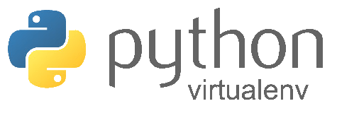

# Creación


Una vez hemos diseñado nuestro bot y sabemos que y como queremos que haga, llega la hora de empezar a programar. Para ello lo primero que deberemos será configurar nuestro entorno instalando todos los paquetes y dependencias que vayan a ser necesarios para ello lo más recomendable es que configuremos nuestro propio entorno virtual. Existen diversas opciones para hacerlo entre las cuales destacan: 

## Conda


Conda es un sistema de administración de paquetes y un sistema de administración de entornos de código abierto que se ejecuta en Windows, macOS, Linux y z/OS. Conda instala, ejecuta y actualiza rápidamente los paquetes y sus dependencias. Conda crea, guarda, carga y cambia fácilmente entre entornos en su computadora local.

## Venv



El módulo venv admite la creación de "entornos virtuales" livianos, cada uno con su propio conjunto independiente de paquetes de Python instalados en sus directorios. Un entorno virtual se crea sobre una instalación de Python existente, conocida como Python "base" del entorno virtual, y puede aislarse opcionalmente de los paquetes en el entorno base, por lo que solo están disponibles los instalados explícitamente en el entorno virtual.

Se pueden crear con:

```Bash
python3 -m venv /path/to/new/virtual/environment
```

## Poetry


Poetry es una herramienta de administración de dependencias de Python para administrar dependencias, paquetes y bibliotecas en su proyecto de Python funciona de forma similar a npm